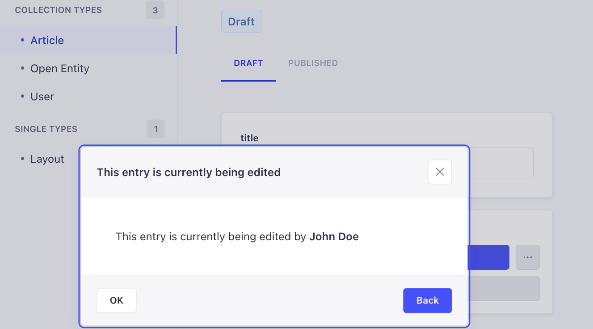

# Strapi Plugin Record Locking (Community Fork)

> This is a community-maintained fork compatible with Strapi 5.24+
> Original: <https://github.com/notum-cz/strapi-plugin-record-locking>

## Strapi plugin content-locking

This plugin provides the functionality to prevent data loss in cases where multiple users are simultaneously editing the same record within STRAPI v5.

**When a user attempts to edit a record that is already being edited, a warning will be displayed.**



## ⚠️ We've released version 2.0.0 for the Record Locking Plugin

Plugin version 2.x is aimed at Strapi V5. If you need support for Strapi V4, please follow the 1.x releases. What's new:

- TypeScript rewrite.
- Overall code refactor to make it safer & more readable.
- Strapi V5 support.
  - Records are now matched based on `document_id` attribute.

## 🙉 What does the plugin do for you?

✅ Safeguards against concurrent editing by restricting access to a record to a single user at a time.

✅ Provides clear visibility of the current editing user, enabling you to easily identify who is working on the record.

## 🧑‍💻 Installation

### 1. Install the plugin with your favourite package manager

```bash
npm i @notum-cz/strapi-plugin-record-locking
```

```bash
yarn add @notum-cz/strapi-plugin-record-locking
```

### 2. Create or modify file `config/plugins.js` and include the following code snippet

```js
module.exports = ({ env }) => ({
  'record-locking': {
    enabled: true,
  },
});
```

We use websockets and you can determine the necessary transport yourself:

```js
module.exports = ({ env }) => ({
  'record-locking': {
    enabled: true,
    config: {
      transports: ['websocket'],
    },
  },
});
```

If you do not specify a transport, the default parameters will be applied:

```js
DEFAULT_TRANSPORTS: ['polling', 'websocket', 'webtransport'];
```

### 3. Enable websocket support by configuring the Strapi middleware

In the `config/middlewares.js` file either replace `'strapi::security'` with a middleware object (see the example below) or update your existing configuration accordingly.

1. Ensure that `contentSecurityPolicy.directives.connect-src` array includes `"ws:"` and `"wss:"`.
2. Rebuild Strapi and test record locking features.
3. You should not encounter any `Content Security Policy` errors in the console.

```js
module.exports = [
  'strapi::errors',
  {
    name: "strapi::security",
    config: {
      contentSecurityPolicy: {
        useDefaults: true,
        directives: {
          "connect-src": ["'self'", "https:", "ws:", "wss:", "http:"],
          "img-src": [
            "'self'",
            "data:",
            "blob:",
          ],
          "media-src": ["'self'", "data:", "blob:"],
          upgradeInsecureRequests: null,
        },
      },
    },
  },
  'strapi::cors', ...
```

> While optional, it is highly **recommended** to implement this step to prevent Socket.io from falling back to the HTTP protocol and generating the following error in the web console.  
> `Refused to connect to <protocol>://<url> because it does not appear in the connect-src directive of the Content Security Policy`

---

## 🧔 Authors

Fork owner: **Decrypt**

## 🔑 Keywords

- [strapi](https://www.npmjs.com/search?q=keywords:strapi)
- [plugin](https://www.npmjs.com/search?q=keywords:plugin)
- [record](https://www.npmjs.com/search?q=keywords:record)
- [lock](https://www.npmjs.com/search?q=keywords:lock)
